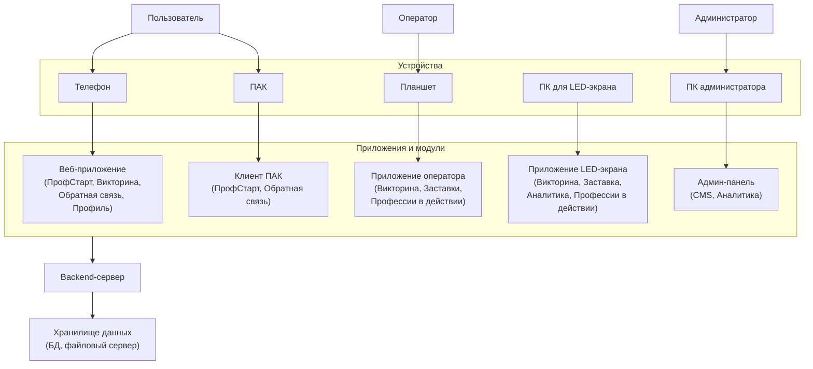
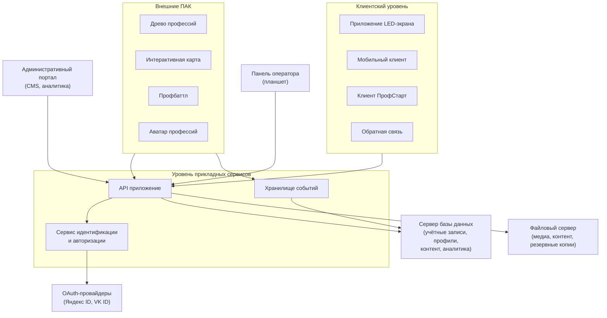

# Архитектурные и блок-схемы

!!! success "Материал готов"

---

## Обзорная схема

---

## Детализированная схема

---

## Описание слоёв

### Клиентский уровень

| Компонент | Описание |
|-----------|----------|
| Приложение LED-экрана | Полноэкранное приложение на медиакомпьютере, визуализация сценариев, видео, интерактивных заданий |
| Мобильный клиент | Веб-приложение на смартфоне посетителя (подключение по QR, ответы, голосования) |
| Клиент ПрофСтарт | Запускается на ПАК, интерактивный тест школьника |
| Обратная связь | Автономные терминалы анкет, оценок, комментариев |
| Административный портал | Веб-интерфейс CMS и аналитики |
| Панель оператора | Веб-интерфейс на планшете (управление сессиями, командами, раундами) |

### Уровень прикладных сервисов (Backend)

| Компонент | Описание |
|-----------|----------|
| API приложение | Единая точка входа для всех клиентов и внешних ПАК. Маршрутизация запросов, бизнес-логика |
| Сервис идентификации и авторизации | OAuth 2.0, выдача токенов, гостевой режим, привязка гостя к профилю |
| Хранилище событий | Буферизация, валидация и сохранение аналитических событий от всех источников |

### Сервер базы данных

| Схема | Содержание |
|-------|-----------|
| Учётные записи | User, StaffUser, OAuth-данные, токены |
| Профили и согласия | Цифровой профиль, ConsentAcceptance, результаты |
| Контент и конфигурации | Сценарии, вопросы, медиа, профессии, шаблоны |
| Аналитические события | AnalyticsEvent, метрики, логи |

### Файловый сервер

Видео, изображения, документы, резервные копии.

---

## Ключевые принципы

1. **Разделение узлов** — Backend-сервер и медиакомпьютер LED — отдельные машины
2. **Модульность** — каждый сервис независим, взаимодействие через API
3. **Безопасность** — токены краткоживущие, пароли не передаются, гостевой режим изолирован
4. **Масштабируемость** — подключение новых ПАК через адаптеры без изменения ядра

---

## Требования

- **Формат:** PDF + SVG/PNG
- **Минимум:** 1 обзорная + 1 детализированная схема
- Читаемость при печати на А3
- Визуальная разница между типами потоков
- Легенда, расшифровка сокращений
- Без декоративных схем — однозначные стрелки и подписи
