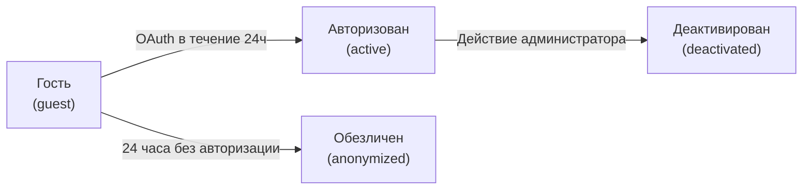
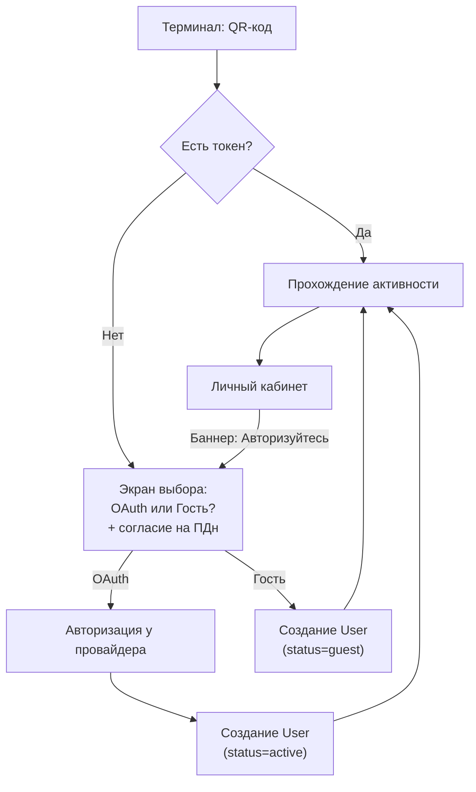
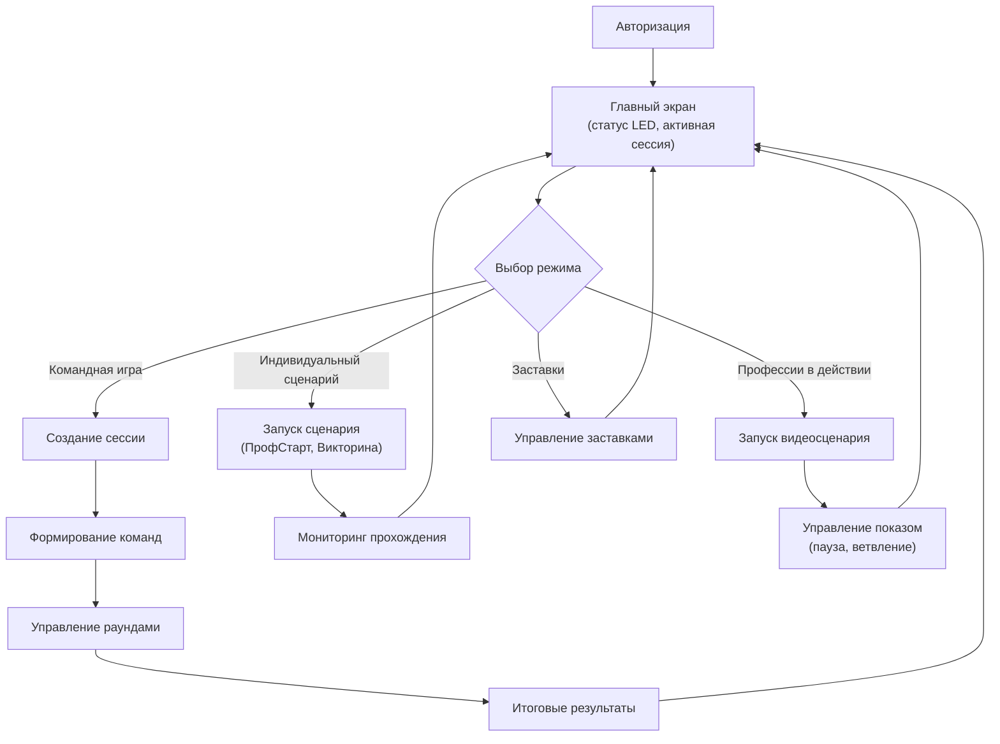
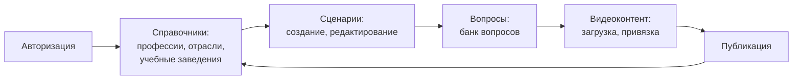
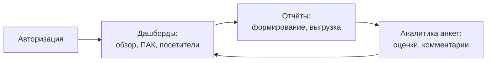
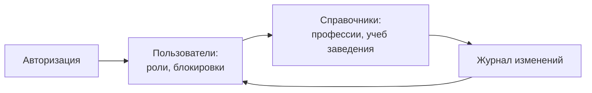
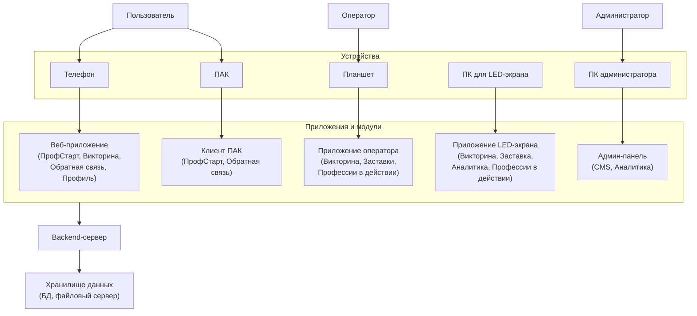
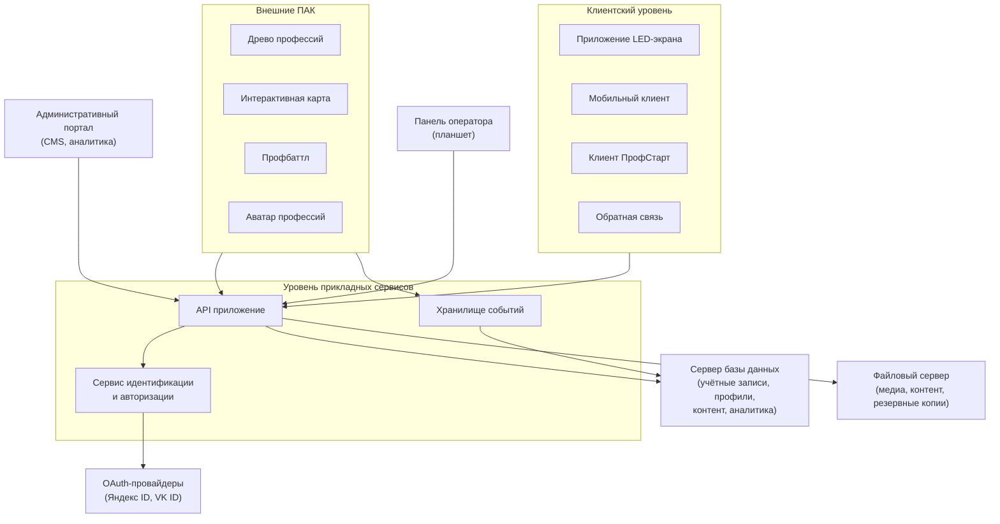

# Пояснительная записка

!!! success "Материал готов"

---

## Основная идея и ценность платформы

**ПрофНавигатор 62** — единая цифровая профориентационная платформа для Центра занятости населения Рязанской области, объединяющая интерактивные сценарии, тестирование, аналитику и управление контентом в целостную экосистему.

### Ценность для посетителя

- **Быстрый старт** — сканирование QR-кода, выбор способа входа (OAuth или гость), начало работы за 30 секунд
- **Персональный маршрут** — цифровой профиль накапливает результаты всех активностей: тесты, викторины, голосования, обратная связь
- **Понятные рекомендации** — профориентационный портрет по 8 направлениям с рекомендациями профессий и учебных заведений
- **Без барьеров** — не нужно регистрироваться заранее, можно начать как гость и авторизоваться позже (в течение 24 часов)

### Ценность для сотрудника (оператора)

- **Единая панель управления** — планшет с доступом ко всем сценариям: викторина, профстарт, профессии в действии, заставки
- **Гибкость проведения** — создание сессий на лету, формирование команд, управление раундами, адаптация под аудиторию
- **Минимум рутины** — автоматический подсчет баллов, генерация рейтингов, сохранение статистики
- **Контроль процесса** — просмотр состояния LED-экрана, экстренный возврат в режим ожидания, ручной ввод ответов

### Ценность для руководителя

- **Консолидированная аналитика** — сводные дашборды по всем ПАК: посещения, популярные профессии, эффективность контента
- **Управляемость контента** — CMS для добавления сценариев, вопросов, видео без привлечения разработчиков
- **Масштабируемость** — подключение новых ПАК и терминалов через адаптеры без изменения ядра системы
- **Соответствие 152-ФЗ** — OAuth-аутентификация, обязательное согласие на обработку ПДн, обезличивание гостевых данных

---

## Сегментация пользователей и ролей

### Пользователи платформы

| Роль | Описание | Устройство | Доступ |
|------|----------|----------|--------|
| **Пользователь** | Посетитель ЦЗН (школьник, студент, взрослый) | Телефон (веб-приложение) | ПрофСтарт, Викторина, Обратная связь, Цифровой профиль |
| **Оператор** | Сотрудник ЦЗН, проводящий мероприятия | Планшет | Управление сессиями, командами, сценариями, заставками |
| **Контент-менеджер** | Наполнение платформы контентом | ПК администратора | CMS: сценарии, вопросы, видео, профессии, шаблоны |
| **Аналитик** | Анализ данных и формирование отчётов | ПК администратора | Дашборды, отчёты, выгрузка данных, аналитика анкет |
| **Администратор** | Управление системой и пользователями | ПК администратора | Управление пользователями, ролями, справочниками, журнал изменений |

### Состояния учётной записи пользователя



**Гость** — создаётся при первом сканировании QR-кода, имеет `guest_id`, может пройти активности. Результаты привязаны к `id` записи.

**Авторизованный** — гость, прошедший OAuth (Яндекс ID или VK ID) в течение 24 часов. Получает доступ к цифровому профилю, истории активностей, рекомендациям.

**Обезличенный** — гость, не авторизовавшийся в течение 24 часов. Результаты и аналитика сохраняются, но связь с пользователем утеряна навсегда.

**Деактивированный** — пользователь, заблокированный администратором. Вход невозможен, данные сохранены.

---

## Карта основных пользовательских маршрутов

### Маршрут пользователя (посетителя)



**Точки перехода между модулями:**

1. **ПрофСтарт** → **Цифровой профиль** — результаты теста автоматически сохраняются в профиль
2. **Викторина** → **Профессии** — после ответа показывается карточка профессии с QR-кодом
3. **Обратная связь** → **Профиль** — оценки и комментарии привязываются к профилю (если авторизован)
4. **Профессии в действии** → **Рекомендации** — после просмотра видео предлагаются связанные профессии

### Маршрут оператора



### Маршрут контент-менеджера



### Маршрут аналитика



### Маршрут администратора



---

## Логическая архитектура

Платформа ПрофНавигатор 62 построена по многоуровневой архитектуре, разделяющей клиентские приложения, прикладные сервисы и хранилища данных. Такое разделение обеспечивает независимую масштабируемость компонентов, упрощает обслуживание и позволяет подключать новые устройства и модули без изменения ядра системы.

### Клиентский уровень

Клиентский уровень включает все пользовательские интерфейсы и приложения, через которые различные категории пользователей взаимодействуют с платформой. Каждое приложение адаптировано под конкретное устройство и сценарий использования.

**Приложение LED-экрана** — полноэкранное desktop-приложение, работающее на медиакомпьютере, подключённом к большому LED-экрану. Это основной инструмент визуализации интерактивных сценариев, видеоконтента, рейтингов и аналитики для аудитории. Приложение работает в автоматическом режиме без участия пользователя, отображая заставки, управляемые оператором сценарии и итоговые результаты. Поддерживает разрешение от Full HD до произвольного размера LED-полотна, обеспечивает целевую частоту 60 кадров/с и плавные переходы между состояниями.

**Мобильный клиент** — веб-приложение (PWA), работающее в браузере смартфона посетителя. Не требует установки из магазина приложений, запускается после сканирования QR-кода на терминале или LED-экране. Через мобильный клиент пользователи подключаются к командным играм, отвечают на вопросы викторины, проходят тест ПрофСтарт, оставляют обратную связь и просматривают свой цифровой профиль. Приложение адаптировано под мобильные экраны, поддерживает работу в гостевом режиме и последующую авторизацию через OAuth.

**Клиент ПрофСтарт** — специализированное приложение, запускаемое на интерактивных панелях ПАК. Предназначено для индивидуального профориентационного тестирования школьников. Работает в киоск-режиме (полноэкранный, без системных элементов), обеспечивает короткий переход между вопросами (не более 500 мс) и формирование профориентационного портрета за 3-5 секунд. Может работать как самостоятельное приложение или вызываться из другого сценария.

**Обратная связь** — автономное приложение для терминалов обратной связи, размещаемых в зоне «Видеорезюме» или других точках сбора. Предназначено для коротких анкет (60-90 секунд) с оценкой удобства, понятности и полезности платформы. Поддерживает условные вопросы, выбор профессий из справочника, необязательные контактные заявки с согласием на обработку ПДн. Работает полностью автономно, отправляя результаты в Хранилище событий.

**Административный портал** — веб-интерфейс для контент-менеджеров, аналитиков и администраторов. Предоставляет доступ к CMS (управление сценариями, вопросами, видео, справочниками), дашбордам аналитики, отчётам, управлению пользователями и журналу изменений. Работает на ПК администратора в обычном браузере, не требует установки дополнительного программного обеспечения.

**Панель оператора** — веб-интерфейс, оптимизированный для планшета. Через неё оператор управляет сессиями на LED-экране: создаёт командные игры, формирует команды, запускает раунды, принимает ответы, управляет таймерами, просматривает статистику. Также оператор может запускать индивидуальные сценарии (ПрофСтарт, Викторина), видеосценарии «Профессии в действии» и управлять заставками. Панель оператора подключается к backend-серверу по локальной сети, обеспечивает отзывчивое управление без задержек.

### Уровень прикладных сервисов (Backend)

Backend-сервер — ядро платформы, обрабатывающее все запросы клиентов, управляющее аутентификацией и аккумулирующее аналитические события. Состоит из трёх независимых компонентов, каждый из которых выполняет свою задачу.

**API приложение** — единая точка входа для всех клиентских приложений и внешних ПАК. Принимает HTTP/HTTPS запросы, маршрутизирует их к соответствующим обработчикам, реализует бизнес-логику платформы. Через API происходит создание и получение учётных записей, прохождение сценариев, сохранение результатов, управление контентом CMS. API следует принципам REST, использует JSON для обмена данными, поддерживает версионирование для обратной совместимости. Все клиенты (мобильное приложение, панель оператора, административный портал, внешние ПАК) взаимодействуют с платформой исключительно через API.

**Сервис идентификации и авторизации** — отвечает за аутентификацию пользователей, выдачу токенов и управление сессиями. Поддерживает OAuth 2.0 для входа через Яндекс ID и VK ID, а также гостевой режим с автоматическим созданием временной учётной записи. Сервис проверяет наличие активного токена при сканировании QR-кода, создаёт новых пользователей при первом контакте, обрабатывает callback от OAuth-провайдеров, генерирует JWT (access + refresh токены) для клиентов. Гостевой режим позволяет начать работу без регистрации — создаётся запись User со статусом `guest` и `guest_id`, действительная 24 часа. Если гость не авторизуется за это время, запись переходит в статус `anonymized` — результаты сохраняются, но связь с пользователем утеряна. Сервис идентификации также записывает принятие согласия на обработку персональных данных (ConsentAcceptance) для всех пользователей, независимо от способа входа.

**Хранилище событий** — компонент для приёма, буферизации и сохранения аналитических событий от всех источников: клиентских приложений, внешних ПАК, сценарного движка. Каждое событие получает уникальный идентификатор (event_id), что обеспечивает идемпотентность — повторная передача того же события не приводит к двойному учёту. Хранилище принимает события по REST API или WebSocket, валидирует структуру, помещает в локальную очередь для обработки и сохраняет в базу данных. Поддерживает буферизацию до 72 часов на случай временной недоступности базы данных. Через Хранилище событий внешние ПАК (Древо профессий, Интерактивная карта, Профбаттл, Аватар профессий) передают аналитические данные в платформу для консолидации в сводных дашбордах.

### Хранилище данных

Хранилище данных разделено на два независимых физических сервера для оптимизации производительности и упрощения резервного копирования.

**Сервер базы данных** — хранит все структурированные данные платформы: учётные записи пользователей (User, StaffUser, OAuth-данные, токены), цифровые профили и согласия (ConsentAcceptance, результаты тестов, история активностей), контент и конфигурации (сценарии, вопросы, видео, профессии, шаблоны), аналитические события (AnalyticsEvent, метрики, логи). Используется PostgreSQL для надёжности, поддержки транзакций и JSON-полей. База данных разделена на логические схемы для изоляции учётных данных, профилей, контента и аналитики. Ежедневное резервное копирование обеспечивает сохранность данных.

**Файловый сервер** — хранит неструктурированные данные: видеоконтент (сценарии, профессии в действии, заставки), изображения (карточки профессий, аватары, иконки), документы (отчёты, шаблоны анкет, согласия), резервные копии базы данных. Отдельный файловый сервер упрощает управление дисковым пространством, позволяет независимо масштабировать хранилище медиафайлов и упрощает резервное копирование. Клиентские приложения получают доступ к файлам через API приложение, которое проксирует запросы к файловому серверу.

### Взаимодействие компонентов

Все клиентские приложения взаимодействуют с backend-сервером через API приложение по протоколу HTTP/HTTPS (REST API). Для обновлений в реальном времени (рейтинги, статусы команд, изменения сценариев) используется WebSocket. Панель оператора и административный портал также подключаются к API, но имеют расширенные права доступа, управляемые через роли (StaffUser с ролями Оператор, Контент-менеджер, Аналитик, Администратор).

Внешние ПАК подключаются к двум компонентам backend: API приложение (для получения конфигураций, справочников, отправки результатов) и Хранилище событий (для передачи аналитических событий). Такое разделение позволяет асинхронно обрабатывать большие объёмы событий без блокировки основного API.

OAuth-провайдеры (Яндекс ID, VK ID) используются только для аутентификации пользователей. Сервис идентификации перенаправляет пользователя на OAuth-провайдер, получает callback с кодом, обменивает код на данные пользователя (имя, email, аватар) и создаёт или обновляет учётную запись в базе данных. OAuth-провайдеры требуют доступа к Интернету, но платформа может работать в гостевом режиме без Интернета.

### Обзорная схема



### Детализированная схема



---

## Структура фронтенд-приложений

Каждое фронтенд-приложение платформы имеет собственную структуру разделов, страниц и навигации, адаптированную под конкретный сценарий использования и устройство. Ниже приведена детальная структура основных веб-приложений.

### Мобильное веб-приложение (телефон пользователя)

Мобильное приложение — основной интерфейс посетителя для взаимодействия с платформой. Запускается в браузере смартфона после сканирования QR-кода.

**Главный раздел:**

- **Стартовый экран** — приветствие, выбор способа входа (OAuth или гость), чекбокс согласия на обработку ПДн
- **Экран подключения к сессии** — отображение текущей активности на LED-экране, статус подключения
- **Экран выбора команды** (для командных игр) — список доступных команд, присоединение к команде

**Раздел активностей:**

- **Викторина** — экран вопроса, варианты ответов, таймер, подтверждение ответа, экран результата
- **ПрофСтарт** — последовательность вопросов теста, прогресс-бар, экран завершения, формирование портрета
- **Голосование** — экран выбора варианта, подтверждение, ожидание результатов
- **Обратная связь** — анкета (оценка удобства, понятности, полезности), выбор профессий, комментарий, контактная заявка

**Раздел цифрового профиля:**

- **Дашборд профиля** — сводка активностей, результаты тестов, рекомендации
- **История активностей** — список пройденных сценариев, даты, результаты
- **Результаты ПрофСтарт** — профориентационный портрет, диаграмма направлений, рекомендуемые профессии
- **Рекомендации** — карьерный маршрут, учебные заведения, профессии
- **Настройки профиля** — имя, аватар, настройки уведомлений, выход

**Баннеры и уведомления:**

- **Баннер авторизации** (для гостей) — предложение авторизоваться через OAuth, кнопка перехода
- **Уведомления** — напоминания о новых активностях, изменениях в профиле

---

### Панель оператора (планшет)

Панель оператора — интерфейс для управления сессиями на LED-экране. Оптимизирована для планшета, обеспечивает быстрый доступ ко всем функциям управления.

**Главный экран:**

- **Статус LED-экрана** — текущее состояние (ожидание, активная сессия, пауза)
- **Активная сессия** — информация о текущем сценарии, количество команд, таймер
- **Быстрые действия** — создание новой сессии, экстренный возврат в режим ожидания

**Раздел управления сессиями:**

- **Создание сессии** — выбор сценарного пакета (командная игра, индивидуальный сценарий)
- **Формирование команд** — список участников, распределение по командам, назначение ролей
- **Управление раундами** — запуск раунда, пауза, завершение, переход к следующему
- **Приём ответов** — открытие/закрытие приёма, ручной ввод ответа, корректировка
- **Таймер** — установка, запуск, пауза, увеличение времени
- **Итоговые результаты** — рейтинг команд, баллы по раундам, показ правильного ответа

**Раздел индивидуальных сценариев:**

- **Запуск ПрофСтарт** — выбор возрастной версии, запуск на ПАК, мониторинг прохождения
- **Запуск Викторины** — выбор тематического пакета, запуск, мониторинг
- **Мониторинг прохождения** — прогресс участников, статистика ответов

**Раздел видеосценариев:**

- **Профессии в действии** — список видеосценариев, запуск, управление показом (пауза, ветвление)
- **Управление ветвлением** — выбор варианта в интерактивном видео, переход к нужной ветке

**Раздел заставок:**

- **Список заставок** — доступные заставки, превью
- **Управление показом** — выбор заставки, настройка порядка, длительности
- **Плейлист** — последовательность показа заставок

**Раздел статистики:**

- **Текущая сессия** — статистика в реальном времени (баллы, ответы, время)
- **Завершённые сессии** — список прошедших сессий, результаты, выгрузка

**Настройки:**

- **Профиль оператора** — имя, смена пароля
- **Технический статус** — состояние компонентов (LED, backend, сеть)
- **Выход** — завершение сессии

---

### Административный портал (CMS)

Административный портал — веб-интерфейс для контент-менеджеров, аналитиков и администраторов. Предоставляет полный доступ к управлению контентом, аналитике и настройкам системы.

**Раздел CMS (Контент-менеджер):**

**Справочники:**

- **Профессии** — список профессий, создание, редактирование, карточка профессии (описание, компетенции, связанные отрасли)
- **Отрасли** — список отраслей, иерархия, привязка профессий
- **Учебные заведения** — каталог учебных заведений, направления подготовки, контакты
- **Работодатели** — каталог работодателей, вакансии, требования

**Сценарии:**

- **Список сценариев** — все сценарии (опубликованные, черновики), фильтры, поиск
- **Создание сценария** — название, описание, выбор типа (командный, индивидуальный), настройка параметров
- **Редактор сценария** — добавление раундов, вопросов, заданий, настройка таймеров, баллов, правил
- **Привязка контента** — видео, изображения, карточки профессий к сценарию
- **Предварительный просмотр** — тестовое прохождение без записи в аналитику
- **Публикация** — перевод из черновика в опубликованное состояние

**Вопросы:**

- **Банк вопросов** — список всех вопросов, фильтры (тип, сложность, теги, возраст)
- **Создание вопроса** — текст, варианты ответов, правильный ответ, медиа (изображение, видео), теги
- **Типы вопросов** — одиночный выбор, множественный выбор, да/нет, выбор изображения, сопоставление, сортировка, шкала согласия, ранжирование, ситуационный кейс
- **Импорт вопросов** — загрузка из CSV/XLSX

**Видеоконтент:**

- **Библиотека видео** — список видео, загрузка, превью, метаданные
- **Привязка к сценариям** — назначение видео сценариям, маркеры времени для вопросов
- **Профессии в действии** — интерактивные видеосценарии с ветвлением, точки выбора

**Анкеты и согласия:**

- **Конструктор анкет** — создание анкет обратной связи, типы вопросов, условная логика
- **Шаблоны анкет** — базовая анкета, оценка терминала, оценка мероприятия
- **Согласия** — шаблоны согласий на обработку ПДн, версионирование

**Раздел Аналитика (Аналитик):**

**Дашборды:**

- **Главный дашборд** — обзор экспозиции (количество сессий, активность, доля завершённых)
- **Дашборд по ПАК** — сводная аналитика по каждому ПАК (Древо профессий, Карта, Профбаттл)
- **Детальный дашборд ПАК** — детальная аналитика по конкретному ПАК (запуски, завершения, результаты)
- **Дашборд посетителей** — воронка взаимодействия, распределение интересов, популярные профессии
- **Дашборд аналитики анкет** — оценки, комментарии, распределение по вопросам

**Отчёты:**

- **Формирование отчёта** — выбор периода, типа отчёта, фильтров
- **Список отчётов** — сохранённые отчёты, шаблоны
- **Выгрузка** — CSV, XLSX, PDF

**Аналитика анкет:**

- **Список анкет** — все проведённые анкеты, фильтры (тип, период, точка сбора)
- **Детальная аналитика** — распределение ответов, средние оценки, комментарии
- **Сопоставление** — связь с общей статистикой (активности, результаты)

**Раздел Администрирование (Администратор):**

**Пользователи:**

- **Список пользователей** — все пользователи (гости, авторизованные), фильтры, поиск
- **Карточка пользователя** — профиль, история активностей, результаты, статус
- **Управление ролями** — назначение ролей сотрудникам (Оператор, Контент-менеджер, Аналитик, Администратор)
- **Блокировка** — деактивация пользователей (перевод в статус `deactivated`)

**Справочники (администрирование):**

- **Управление справочниками** — добавление, редактирование, удаление записей
- **Импорт/экспорт** — загрузка справочников из CSV/XLSX, выгрузка

**Журнал изменений:**

- **Список изменений** — все действия в системе (создание, редактирование, удаление)
- **Фильтры** — по пользователю, типу действия, периоду
- **Детали изменения** — что было изменено, кем, когда

**Настройки системы:**

- **Общие настройки** — название платформы, логотип, контакты
- **Настройки аутентификации** — OAuth-провайдеры, параметры токенов
- **Настройки резервного копирования** — расписание, хранение

---

## Обоснование разделения backend-сервера и медиакомпьютера LED

### Почему это разные машины

**Backend-сервер** — вычислительный узел для обработки запросов, хранения данных, авторизации. Требования:
- Процессор: 8+ ядер, 128 ГБ RAM
- Накопители: RAID10, 3.8+ ТБ
- Работа 24/7, резервное питание

**Медиакомпьютер LED** — графическая станция для рендеринга видео и интерактивных сценариев на LED-экран. Требования:
- Процессор: 12+ ядер, 64+ ГБ RAM
- GPU: 8+ ГБ видеопамяти, поддержка H.264/H.265/AV1
- Видеовыходы: HDMI 2.0+ / DisplayPort 1.4+
- Целевая частота: 60 кадров/с

### Преимущества разделения

1. **Специализация оборудования** — каждый узел оптимизирован под свои задачи (вычисления vs графика)
2. **Независимая масштабируемость** — можно улучшить GPU для LED без апгрейда backend
3. **Отказоустойчивость** — выход из строя медиакомпьютера не влияет на backend и наоборот
4. **Упрощение обслуживания** — замена видеокарты не требует остановки сервера баз данных

### Взаимодействие

Медиакомпьютер LED подключается к backend-серверу по локальной сети (1+ GbE), получает:
- Контент сценариев и видео
- Команды от панели оператора
- Отправляет аналитические события в Хранилище событий

---

## Принцип автономной работы в локальной сети

### Работа без Интернета

Платформа работает полностью автономно в локальной сети без доступа к Интернету:
- Все сценарии, видео, вопросы хранятся локально на файловом сервере
- База данных с учётными записями, профилями, аналитикой — на отдельном сервере
- OAuth-провайдеры (Яндекс ID, VK ID) требуют Интернета, но гостевой режим работает без них

### Локальная аутентификация

При отсутствии Интернета:
- Гостевой режим работает полностью локально (создание `guest_id`, привязка результатов)
- OAuth-авторизация недоступна — пользователь может продолжить как гость
- При восстановлении Интернета гость может авторизоваться (в течение 24 часов)

### Синхронизация внешних ПАК

Внешние ПАК (Древо профессий, Интерактивная карта, Профбаттл) могут работать автономно:
- Локальная очередь событий на стороне ПАК (буферизация до 72 часов)
- При восстановлении связи — автоматическая передача событий в Хранилище
- Идемпотентный приём — повторная передача не приводит к двойному учёту

---

## Подход к расширению новыми ПАК, сценариями, терминалами

### Подключение новых ПАК

**Архитектурный принцип:** модульность и адаптеры.

Для подключения нового ПАК необходимо:
1. **Адаптер интеграции** — компонент, преобразующий события ПАК в единую модель `AnalyticsEvent`
2. **Протокол обмена** — REST API, WebSocket, HTTP или экспорт JSON/CSV
3. **Справочник соответствий** — маппинг сущностей ПАК (профессии, отрасли) на единый справочник

**Пример подключения:**
```
ПАК "Новый терминал" → Адаптер → AnalyticsEvent → Хранилище событий → Дашборды
```

### Добавление новых сценариев

**Через CMS (без изменения кода):**
- Создание новых вопросов викторины
- Настройка сценарных раундов (последовательность, таймеры, баллы)
- Загрузка видеоконтента и привязка к сценариям
- Публикация черновика → тестирование → публикация

**С разработкой (требует программирования):**
- Новые типы заданий (например, AR/VR)
- Нестандартные механики взаимодействия
- Интеграция с внешними сервисами

### Подключение новых терминалов

**Стандартные терминалы:**
- ПАК ПрофСтарт — клиентское приложение, подключение по API
- Терминалы обратной связи — автономное приложение, отправка событий в Хранилище

**Нестандартные терминалы:**
- Требуется клиентское приложение под платформу терминала
- Взаимодействие с backend через API
- Аутентификация — через OAuth или гостевой режим

---

## Краткое описание технологий и протоколов

### Технологии

| Компонент | Технология | Обоснование |
|-----------|-----------|-------------|
| Backend API | REST/JSON | Универсальность, простота интеграции |
| База данных | PostgreSQL | Надёжность, поддержка JSON, транзакции |
| Файловое хранилище | Локальный файловый сервер | Простота, контроль, резервное копирование |
| Мобильный клиент | Веб-приложение (PWA) | Кроссплатформенность, не требует установки |
| Приложение LED | Desktop-приложение (Electron/Tauri) | Полноэкранный режим, доступ к GPU |
| Панель оператора | Веб-интерфейс | Адаптивность под планшет, быстрый доступ |
| CMS | Веб-интерфейс | Управление контентом из браузера |

### Протоколы

| Протокол | Назначение |
|----------|-----------|
| HTTP/HTTPS | REST API для всех клиентов |
| WebSocket | Обновления в реальном времени (рейтинги, статусы) |
| OAuth 2.0 | Аутентификация через Яндекс ID, VK ID |
| JWT | Краткоживущие токены сессий |
| TCP/UDP | Интеграция с физическими устройствами (считыватели карт) |

### Форматы данных

| Формат | Использование |
|--------|---------------|
| JSON | API-запросы, события аналитики, конфигурации |
| MP4/H.264 | Видеоконтент сценариев |
| CSV/XLSX | Выгрузка отчётов и аналитики |
| PDF | Формирование документов и отчётов |

---

## Требования

- **Объём:** 10–20 страниц
- **Формат предоставления:** DOCX и PDF
- Допускается объединение с презентацией
