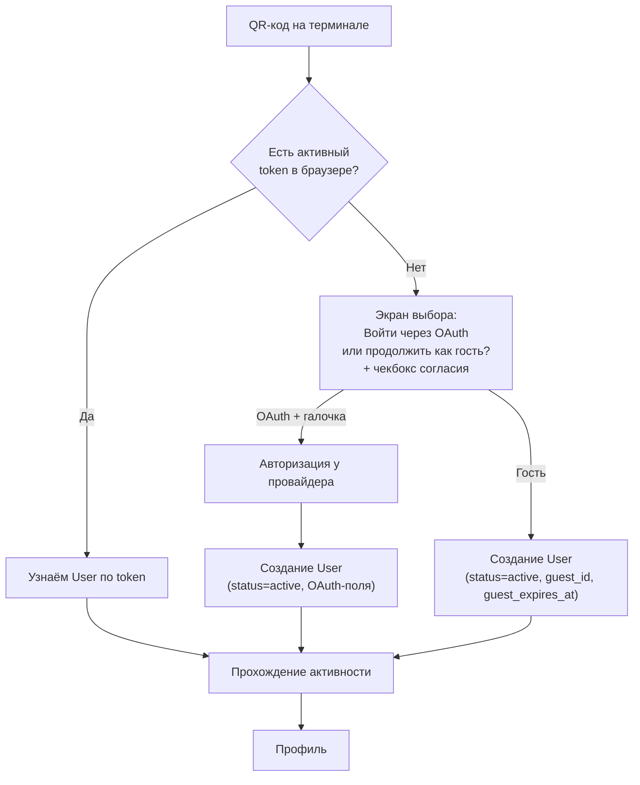
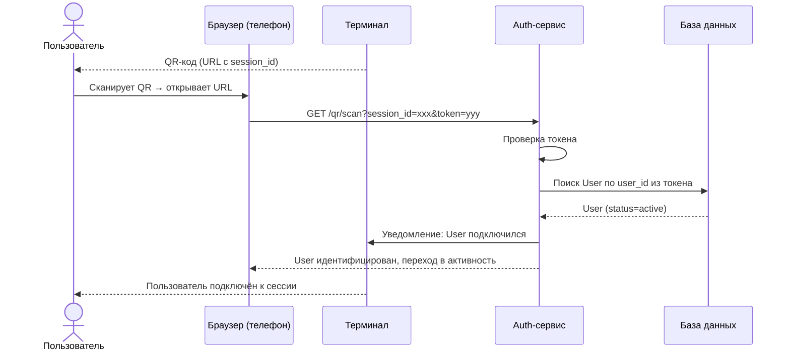
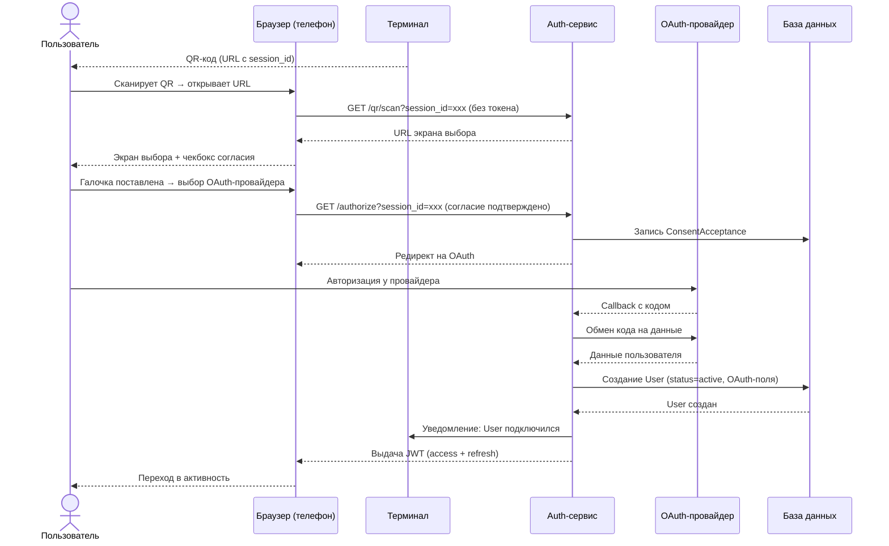
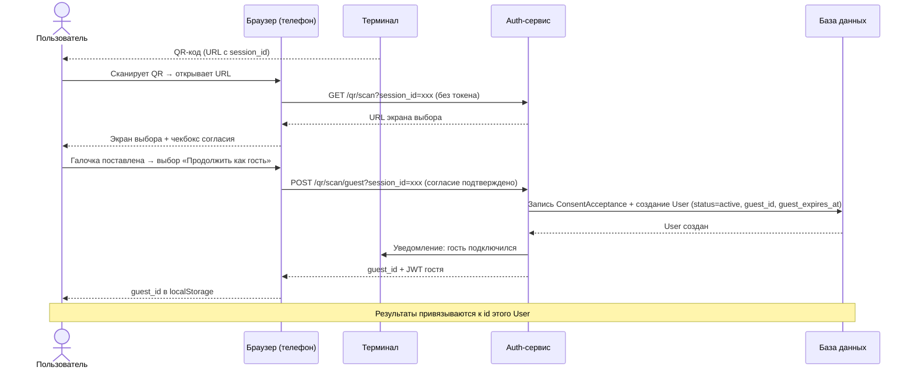
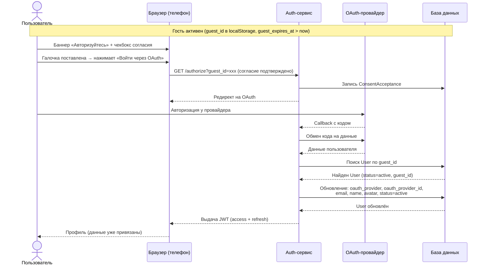
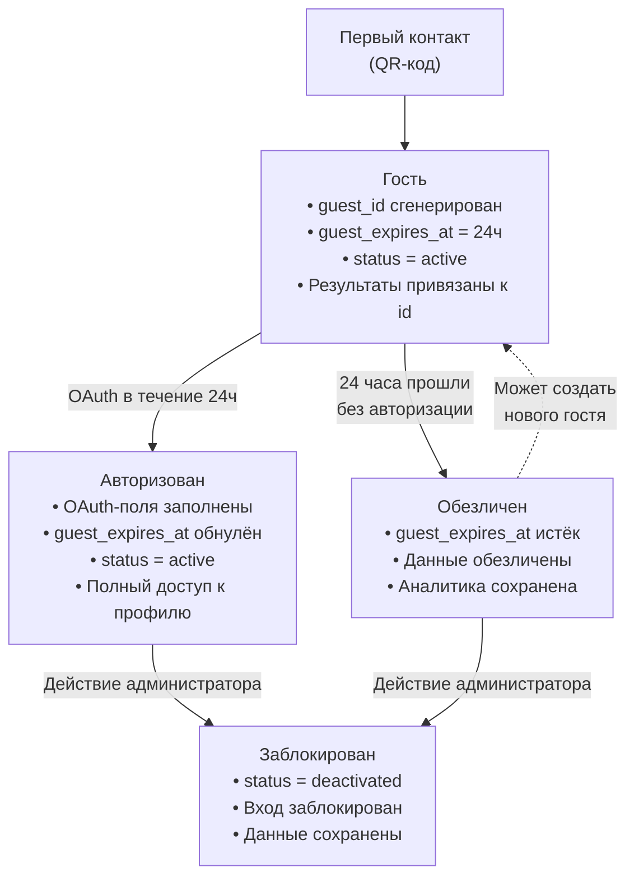

# Материалы по регистрации и профилю

!!! success "Материал готов"

---

## Модель регистрации

Единая запись `User` — пользователь создаётся при первом сканировании QR-кода. В зависимости от наличия OAuth-данных он находится в гостевом или авторизованном состоянии.

- **Гость** — `status = active`, есть `guest_id` и `guest_expires_at`, нет OAuth-данных
- **Авторизованный** — `status = active`, заполнены OAuth-поля

Результаты всех активностей всегда привязаны к `id` пользователя. При переходе из гостевого режима в авторизованный **перенос данных не требуется**.

Провайдеры OAuth:
- **Яндекс ID** — имя, email, аватар, дата рождения
- **VK ID** — имя, email, аватар, пол, дата рождения

Для сотрудников системы (StaffUser) используется отдельная модель — email/пароль с ролями.

---

## 1. Маршрут пользователя (User Flow)

### Ключевые решения

- При сканировании QR проверяется **наличие токена** в браузере
- Если токен есть — пользователь узнаётся, **новая запись не создаётся**
- Если токена нет — **экран выбора**: авторизоваться через OAuth или продолжить как гость
- При выборе OAuth → создание User со `status = active`, принятие согласия
- При выборе гостя → создание User со `status = active`, `guest_id`, `guest_expires_at`
- Результаты всегда привязаны к `id` — **перенос не нужен**
- Гость может авторизоваться позже (в течение 24ч) — OAuth-поля заполнятся у той же записи
- Гость видит предложение авторизоваться **на каждой странице** личного кабинета

---

## 2. Sequence-схема входа

### Сценарий 1: Авторизованный пользователь (есть токен)

### Сценарий 2: Первый контакт — выбор OAuth

### Сценарий 3: Первый контакт — выбор «Гость»

### Сценарий 4: Гость авторизуется позже (в течение 24ч)

---

## 3. Состояния учётной записи

### Пользователь (User)

**Описание статусов и состояний:**

| Статус | Описание | Как попадает |
|--------|----------|--------------|
| `active` | Активен (независимо от способа входа) | Первый контакт (QR-код) или авторизация через OAuth |
| `deactivated` | Заблокирован администратором | Действие администратора |

**Состояния гостевого режима** (определяются по полям `guest_id` и `guest_expires_at`, не являются статусами):

| Состояние | Условие | Описание |
|-----------|---------|----------|
| Гость | `guest_id IS NOT NULL AND guest_expires_at > now()` | Гостевой режим, 24 часа на авторизацию через OAuth |
| Обезличен | `guest_id IS NOT NULL AND guest_expires_at < now()` | Гость не авторизовался, данные обезличены |

**Обезличивание:** если гость не авторизовался в течение 24 часов, `guest_expires_at` истекает, связь с гостем утеряна навсегда. Результаты и аналитика сохраняются, но привязаны к `id` записи без возможности восстановления личности.

---

## 4. Интерфейсные экраны

### Экран 1: Терминал — QR-код для входа

**Где отображается:** большой LED-экран, интерактивная панель

**Содержание:**
- Заголовок: «Сканируйте QR-код для участия»
- Крупный QR-код в центре экрана
- Пояснение: «Наведите камеру телефона на QR-код»
- URL для ручного ввода (на случай, если камера не работает)

---

### Экран 2: Телефон — выбор способа входа

**Где отображается:** мобильное устройство пользователя (после сканирования QR)

**Содержание:**
- Заголовок: «Как вы хотите продолжить?»
- Кнопка «Войти через Яндекс ID» (логотип + текст)
- Кнопка «Войти через VK ID» (логотип + текст)
- Кнопка «Продолжить как гость» (менее выделенная)
- Чекбокс «Я принимаю условия [согласия на обработку персональных данных](../entities/consent.md)» (обязательный)
- Пояснение: «Авторизация через Яндекс или VK — быстро и безопасно»

---

### Экран 3: Телефон — личный кабинет (авторизованный)

**Где отображается:** мобильное устройство, веб-портал (PWA), доступен после входа через OAuth

**Содержание:** в соответствии с [интерфейсом личного кабинета пользователя](../interfaces/mobile-client/index.md)

---

### Экран 4: Телефон — личный кабинет (гость)

**Где отображается:** мобильное устройство, веб-портал (PWA), доступен после выбора «Продолжить как гость»

**Содержание профиля:** в соответствии с [интерфейсом личного кабинета](../interfaces/mobile-client/index.md) (гостевой режим)

**Баннер предложения авторизации:**

Блок в контенте или плавающий блок. Содержит:
- Текст: «Авторизуйтесь для полного доступа. Ваши результаты уже сохранены.»
- Кнопка «Авторизоваться» → переход на экран выбора способа входа (без кнопки «Продолжить как гость», вместо неё — «Отмена» для возврата в гостевой профиль)

---

## Требования

- **Формат:** PDF/SVG/PNG
- Пользовательская схема (маршрут)
- Sequence-схема входа
- Основные состояния учётной записи
- Не менее 4 интерфейсных экранов регистрации/входа/профиля

