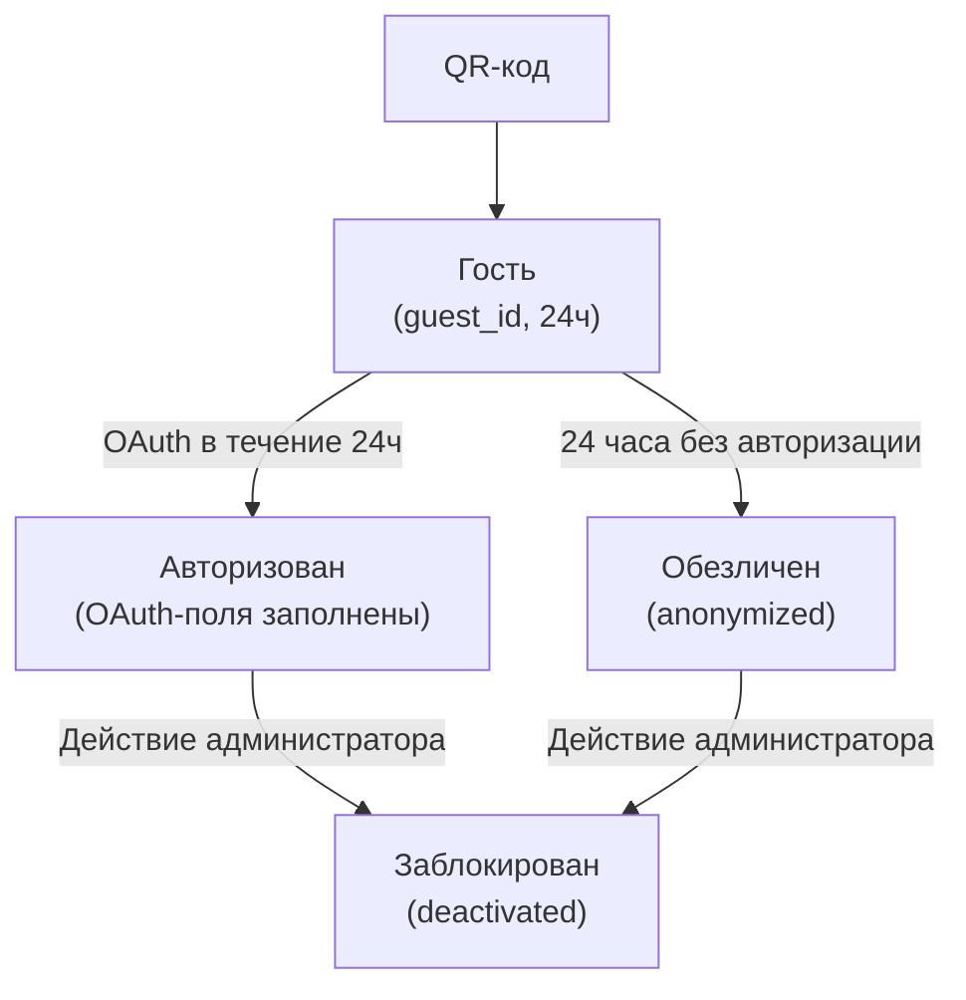

# Пользователи

Описание сущностей для работы с сотрудниками системы и пользователями платформы.

---

## StaffUser (Сотрудник системы)

Учётная запись сотрудника системы администрирования (CMS). Используется для управления доступом к функционалу платформы.

### Атрибуты

| Поле | Тип | Описание |
|------|-----|----------|
| `id` | integer (int64, автоинкремент) | Уникальный идентификатор сотрудника |
| `first_name` | string | Имя |
| `last_name` | string | Фамилия |
| `email` | string | Email для входа и уведомлений |
| `password_hash` | string | Хеш пароля |
| `role` | enum | Роль: `admin`, `operator`, `analyst`, `content_editor` |
| `status` | enum | Статус: `active`, `blocked` |
| `last_login_at` | timestamp, nullable | Дата последнего входа |
| `created_at` | timestamp | Дата создания учётной записи |
| `updated_at` | timestamp | Дата последнего обновления |

### Роли

| Роль | Код | Права |
|------|-----|-------|
| Администратор | `admin` | Полный доступ ко всем разделам, управление сотрудниками |
| Оператор | `operator` | Управление сценариями на планшете LED |
| Аналитик | `analyst` | Просмотр аналитики и отчётов |
| Контент-редактор | `content_editor` | Управление контентом в CMS (справочники, вопросы, шаблоны, аватары, видеосценарии) |

### Связи

- **StaffUser** — независимая сущность, не связана с данными пользователей платформы

### Где используется

- **CMS** — управление учётными записями сотрудников, назначение ролей
- **Авторизация** — вход в CMS по email и паролю

---

## User (Пользователь платформы)

Единая учётная запись пользователя платформы. Создаётся при первом взаимодействии (сканирование QR-кода) и может быть гостевой или авторизованной в зависимости от наличия OAuth-данных.

### Атрибуты

| Поле | Тип | Описание |
|------|-----|----------|
| `id` | integer (int64, автоинкремент) | Уникальный идентификатор пользователя |
| `guest_id` | string, nullable | Уникальный идентификатор гостя (генерируется при первом QR, если пользователь не авторизован) |
| `guest_expires_at` | timestamp, nullable | Срок действия гостевого режима (24 часа от создания). Если null — пользователь авторизован |
| `oauth_provider` | integer, nullable | Провайдер авторизации: `1` — Яндекс, `2` — VK. Null для гостя |
| `oauth_provider_id` | string, nullable | ID пользователя у провайдера. Null для гостя |
| `email` | string, nullable | Email из OAuth-провайдера |
| `name` | string, nullable | Имя из OAuth-провайдера |
| `avatar_url` | string, nullable | URL аватара из OAuth-провайдера |
| `gender` | integer, nullable | Пол: `1` — male, `2` — female, `null` — не указан |
| `birth_date` | date, nullable | Дата рождения из OAuth-провайдера |
| `status` | integer | Статус: `1` — active, `2` — deactivated |
| `created_at` | timestamp | Дата создания учётной записи |
| `updated_at` | timestamp | Дата последнего обновления |

### Статусы пользователя

| Статус | Описание |
|--------|----------|
| `active` | Активен (независимо от способа входа — гость или OAuth) |
| `deactivated` | Заблокирован администратором: данные сохранены, вход невозможен |

### Состояния гостевого режима

Состояние определяется по полям `guest_id` и `guest_expires_at`, не является отдельным статусом:

| Состояние | Условие | Описание |
|-----------|---------|----------|
| Гость с активной сессией | `guest_id IS NOT NULL AND guest_expires_at > now()` | Гость может авторизоваться через OAuth, связав данные |
| Обезличен | `guest_id IS NOT NULL AND guest_expires_at < now()` | Гость не авторизовался за 24ч, данные обезличены, связать с будущей авторизацией нельзя |

### Переходы между состояниями

### Логика гостевого режима

- При первом сканировании QR-кода создаётся User со `status = active`, генерируется `guest_id` и `guest_expires_at` (текущее время + 24 часа)
- Все результаты (аналитика, анкеты, тесты) привязываются к `id` пользователя
- Если в течение 24 часов пользователь авторизуется через OAuth — `guest_id` сохраняется, заполняются OAuth-поля, `guest_expires_at` обнуляется (пользователь становится обычным авторизованным)
- Если 24 часа прошли без авторизации — `guest_expires_at` истекает, пользователь считается обезличенным (anonymized). Данные остаются в системе (аналитика не удаляется), но связать этого пользователя с будущей авторизацией нельзя

### Связи

- **User → AnalyticsEvent**: один пользователь может иметь множество событий аналитики (`user_id`)
- **User → SurveyResponse**: один пользователь может иметь множество ответов на анкеты (`user_id`)
- **User → ConsentAcceptance**: один пользователь может иметь несколько записей о принятии согласий (разные версии)
- **User → TestSession**: один пользователь может иметь множество сессий тестирования (`user_id`)
- **User → GameSession**: один пользователь может участвовать в игровых сессиях (`user_id`)

### Где используется

- **Идентификация и регистрация** — единая сущность для гостевого и авторизованного режимов
- **Цифровой профиль** — агрегация данных пользователя
- **LED-медиаплатформа** — привязка результатов сессий к пользователю
- **ПрофСтарт** — привязка результатов теста к пользователю
- **Обратная связь** — привязка ответов на анкеты к пользователю
- **Аналитика** — привязка событий к пользователю, управление учётной записью (деактивация)

### Примечания

- Единая сущность для гостя и авторизованного пользователя упрощает модель: не нужно переносить данные при привязке
- Результаты всегда привязаны к `id` пользователя, независимо от статуса
- OAuth-данные заполняются при авторизации, `guest_id` может сохраниться для истории
- Удаление аккаунта не поддерживается — только деактивация
