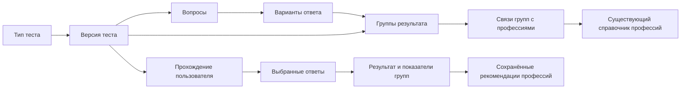

# ПрофСтарт

Индивидуальное прохождение трёх предзаданных профориентационных тестов на сенсорной панели и в личном кабинете. Ответы увеличивают показатели соответствующих групп результата; профессии подбираются через связи этих групп с существующим справочником `Profession`.

!!! note "Проектируемая модель"
    Этот раздел описывает новую структуру и целевой API. Backend и миграции в рамках обновления документации не реализуются. ТЗ остаётся исходным документом; способы расчёта и рекомендации, обозначенные здесь как правила проекта, дополняют его.

## Три предзаданных типа тестов

У всех вопросов type=single_choice: один вариант ответа. Подписи шкалы, текстовые действия и изображения различаются только представлением.

| Код TestType | Тест | Задания | Результат |
|---|---|---|---|
| `solomin` | Анкета «Ориентация», И. Л. Соломин | 42 утверждения: по 3 на группу в каждом из двух блоков, оценка 0–3 | 7 групп отдельно для «Хочу» и «Могу»: 14 показателей |
| `holland` | Тест на основе теории Дж. Голланда | 15 ситуаций, выбор одного из 6 действий | 6 типов RIASEC |
| `dellinger` | Геометрический тест Сьюзен Деллингер | Одно задание, выбор одной из 5 фигур | 5 геометрических групп |

Типы записываются в новую таблицу `test_types`; предзаданные коды solomin, holland, dellinger неизменяемы. CMS может создавать новые типы и редактировать их названия/описания. Удаление типа, используемого активным тестом, запрещено; ссылки остальных тестов также защищены FK. Итоговый расчёт и пользовательское прохождение пока поддерживают только три предзаданных кода. CMS управляет версиями тестов, вопросами, вариантами, весами, группами и связями профессий. [Методики и отличие адаптаций от исходных инструментов](methods.md).

## Структура

Группы принадлежат версии теста и не заменяют `Direction`: семь групп Соломина, шесть типов Голланда и пять фигур Деллингер имеют разные значения. Одна профессия может быть связана с несколькими группами разных тестов.

## Версии и прохождение

Тест имеет status=draft, active или archived. Черновик есть только у теста: status=draft, published_at=null. Публикация проверяет весь состав, активирует тест и заполняет дату. Группы, вопросы и варианты не имеют отдельных черновиков, статусов и публикаций; group_id и weight хранятся непосредственно в варианте.

Для одного типа допускается не более одного active, независимо от номера версии. Публикация нового теста атомарно переводит прежний active в archived. Можно архивировать активный тест без замены — тогда новых стартов этого типа нет. Active и archived неизменяемы; изменения готовятся в копии со status=draft. Начатые сессии продолжают свою версию и могут завершаться после её архивирования.

Возрастные группы задают доступность версии, а не случайную сборку вопросов. Проходится весь фиксированный набор. Для новых стартов не выбираются одновременно разные возрастные версии одного типа; такое расширение требует отдельного правила выбора версии.

→ [Прохождение](test-flow.md) · [Результаты](results.md) · [Сущности](../../entities/test.md) · [CMS](../cms/profstart.md) · [API](../../api/profstart.md)

## Интеграция и интерфейсы

Сессия и результат всегда имеют `user_id`, включая гостя. После авторизации гостя данные остаются у той же записи User. В цифровом профиле показываются отдельные результаты трёх методик и история; общий балл между ними, восемь универсальных направлений и компетенции из этих ответов не вычисляются.

Киоск очищает экран после завершения или таймаута, веб-версия сохраняет историю. Переход между вопросами — до 500 мс, расчёт — до 3 секунд, формирование экрана результата — до 5 секунд; одновременно — не менее 10 панелей. Время видимости результата задаётся клиентом киоска и не хранится в тесте.

Результаты имеют информационно-рекомендательный характер. «Могу» у Соломина — самооценка, а выбор фигуры — предпочтение в сокращённом сценарии; эти данные не устанавливают профессиональную пригодность.

## Сопоставление с исходным ТЗ

Исходные разделы [3.2.4](../../tech-spec/03-composition.md) и [4.18](../../tech-spec/04-software-structure.md) сохранены как источник требований. Текущая модель отражает новые решения по трём методикам; для приёмочных критериев необходимо согласовать следующие различия.

| Требование исходного ТЗ | Текущая модель |
|---|---|
| Не менее 60 вопросов в общем банке | Одна версия каждого типа содержит 42 + 15 + 1 = 58 вопросов. Минимум банка требует дополнительных материалов в других версиях или изменения требования; размеры этих тестов фиксированы |
| Не менее двух возрастных версий | Возраст задаётся списком доступности одного active-теста на тип. Одновременные активные возрастные версии одного типа не предусмотрены |
| Восемь направлений и шаблонов портрета, три ведущих направления | Отдельные группы каждой методики, все равные положительные максимумы; общего портрета по восьми Direction нет |
| Не менее трёх типов заданий, множественный выбор и ранжирование | Один тип single_choice с тремя представлениями вариантов: шкала, действия, фигуры |
| От 5 до 12 профессий и отдельные признаки качества | Все подходящие профессии, в том числе пустой список; признаки качества и лимит в тесте не хранятся |
| Локальный расчёт клиента | Сервер считает и сохраняет результат по закреплённой версии сессии |

Размеры согласованных тестов остаются 42/15/1. Банк текстов, изображения и экспертные связи профессий требуют наполнения и утверждения до запуска.
