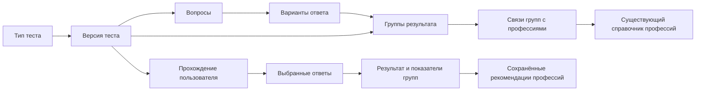

# ПрофСтарт

Индивидуальное прохождение трёх предзаданных профориентационных тестов на сенсорной панели и в личном кабинете. Ответы увеличивают показатели соответствующих групп результата; профессии подбираются через связи этих групп с существующим справочником `Profession`.

!!! note "Проектируемая модель"
    Этот раздел описывает новую структуру и целевой API. Backend и миграции в рамках обновления документации не реализуются. ТЗ остаётся исходным документом; способы расчёта и рекомендации, обозначенные здесь как правила проекта, дополняют его.

## Три типа тестов

У всех вопросов type=single_choice: один вариант ответа. Подписи шкалы, текстовые действия и изображения различаются только представлением.

| Код TestType | Тест | Задания | Результат |
|---|---|---|---|
| `solomin` | Анкета «Ориентация», И. Л. Соломин | 70 утверждений, оценка 0–3 | 7 групп отдельно для «Хочу» и «Могу»: 14 показателей |
| `holland` | Тест на основе теории Дж. Голланда | Не менее 10 ситуаций, выбор одного из 6 действий | 6 типов RIASEC |
| `dellinger` | Геометрический тест Сьюзен Деллингер | Одно задание, выбор одной из 5 фигур | 5 геометрических групп |

Типы записываются в новую таблицу `TestType`; их системные коды фиксированы. CMS управляет версиями тестов, вопросами, вариантами, весами, группами и связями профессий. [Методики и отличие адаптаций от исходных инструментов](methods.md).

## Структура

Группы принадлежат версии теста и не заменяют `Direction`: семь групп Соломина, шесть типов Голланда и пять фигур Деллингер имеют разные значения. Одна профессия может быть связана с несколькими группами разных тестов.

## Версии и прохождение

Черновик есть только у теста: published_at=null. Публикация проверяет весь состав и устанавливает дату. Группы, вопросы и варианты не имеют отдельных черновиков, статусов и публикаций; group_id и weight хранятся непосредственно в варианте.

Для новых прохождений выбирается опубликованная версия с наибольшим version типа. Старые версии остаются неизменяемыми для истории и начатых сессий. Изменение опубликованного состава готовится в копии теста; отдельного архивирования нет.

Возрастные группы задают доступность версии, а не случайную сборку вопросов. Проходится весь фиксированный набор. Для новых стартов не выбираются одновременно разные возрастные версии одного типа; такое расширение требует отдельного правила выбора версии.

→ [Прохождение](test-flow.md) · [Результаты](results.md) · [Сущности](../../entities/test.md) · [CMS](../cms/profstart.md) · [API](../../api/profstart.md)

## Интеграция и интерфейсы

Сессия и результат всегда имеют `user_id`, включая гостя. После авторизации гостя данные остаются у той же записи User. В цифровом профиле показываются отдельные результаты трёх методик и история; общий балл между ними, восемь универсальных направлений и компетенции из этих ответов не вычисляются.

Киоск очищает экран после завершения или таймаута, веб-версия сохраняет историю. Переход между вопросами — до 500 мс, расчёт — до 3 секунд, формирование экрана результата — до 5 секунд; одновременно — не менее 10 панелей. Время видимости результата задаётся клиентом киоска и не хранится в тесте.

Результаты имеют информационно-рекомендательный характер. «Могу» у Соломина — самооценка, а выбор фигуры — предпочтение в сокращённом сценарии; эти данные не устанавливают профессиональную пригодность.
