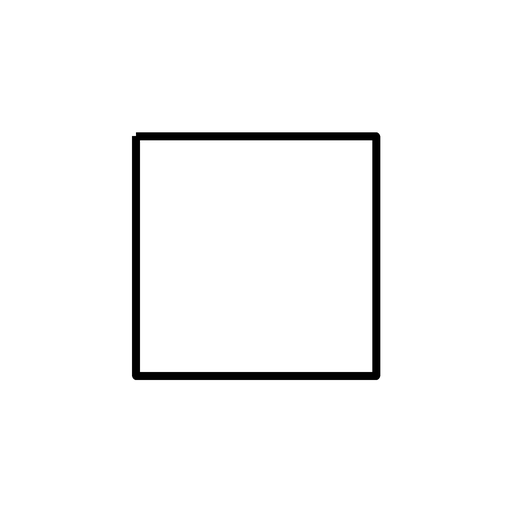
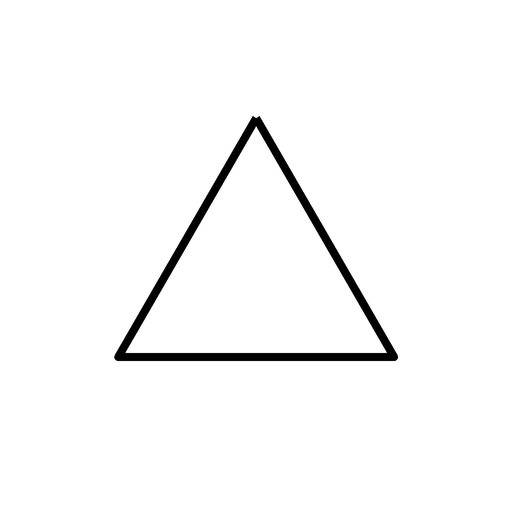
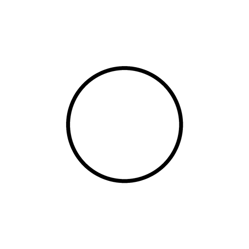
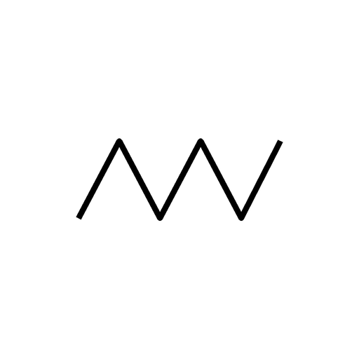
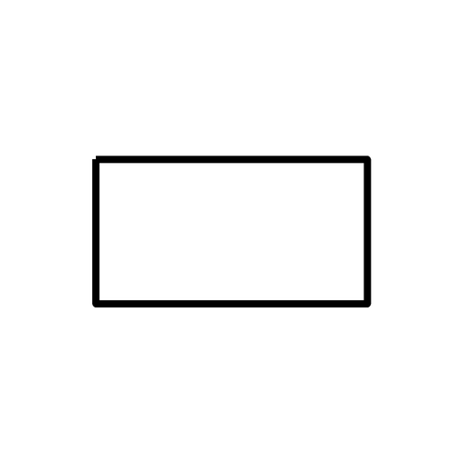

# Геометрический тест Сьюзен Деллингер

Начальный банк сокращённого сценария проекта: один выбор из пяти фигур. Формат изображения или карточки предусмотрен в предоставленном файле «Тесты.docx». [Публикация профильного центра](https://pms-centr.spb.ru/materialy-spetsialistov/785-psikhogeometricheskij-test-s-dellinger) описывает выбор первой фигуры и дальнейшее упорядочивание; в ПрофСтарт согласован только один выбор. Современный [официальный PsychoGeometrics](https://psychogeometrics.com/about/overview/) использует собственный опросник; он этим вопросом не воспроизводится.

## Инструкция для участника

Посмотрите на все пять фигур и выберите одну, которая сейчас кажется вам наиболее близкой. Ориентируйтесь на первое личное впечатление. Если трудно выбрать, отметьте ту, которая первой привлекла внимание. Здесь нет правильного ответа; упорядочивать остальные фигуры не нужно.

## Вопрос 1

**Какая из этих фигур сейчас больше всего соответствует тому, как вы ощущаете себя?**

Параметры вопроса: order=1, type=single_choice, axis=general. Общего файла вопроса нет. У каждого варианта value=null, weight=1; файл прикрепляется к самому варианту.

| order варианта | text | Группа для CMS | weight | Изображение |
|---|---|---|---|---|
| 1 | Квадрат | `square` | 1 | { width="128" height="128" } |
| 2 | Треугольник | `triangle` | 1 | { width="128" height="128" } |
| 3 | Круг | `circle` | 1 | { width="128" height="128" } |
| 4 | Зигзаг | `zigzag` | 1 | { width="128" height="128" } |
| 5 | Прямоугольник | `rectangle` | 1 | { width="128" height="128" } |

## Требования к изображениям и загрузке

Пять PNG подготовлены для проекта: размер 512×512, белый фон, одинаковая чёрная линия. Квадрат и прямоугольник визуально различимы; зигзаг — незамкнутая ломаная. Цвет, декоративные элементы и подписи с характеристиками не используются. В интерфейсе все карточки имеют одинаковый размер и показываются одновременно, подписи — только названия фигур.

Seed-миграция `0051` создаёт черновик из bank.json без изображений. Пять изображений фигур загружаются в варианты через CMS с использованием общего файлового API. Файлы рядом с этой страницей показывают соответствующие фигуры; ID назначаются базой.

Для замены изображения через CMS файл соответствующего варианта загружается в file через multipart/form-data, file_title — его название. PNG является основным файлом; отдельный file_preview необязателен. В пользовательском ответе изображение берётся из file.url.

## Ключ результата

Выбранная группа получает 1, остальные четыре — 0. Максимум каждой группы 1; показатель 100 означает факт выбора. Характеристики групп и связанные профессии показываются после ответа. Прямоугольник трактуется как описание текущего состояния в принятой адаптации; его выбор обрабатывается так же, как остальных фигур. Связи профессий задаются CMS, автоматического переноса связей из Соломина нет.

[Банк тестов](index.md) · [Методики и группы](../methods.md) · [Расчёт](../results.md).
